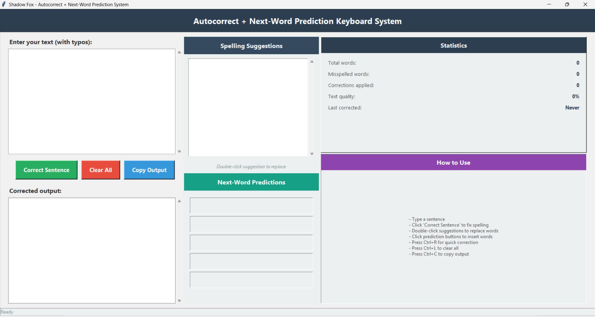
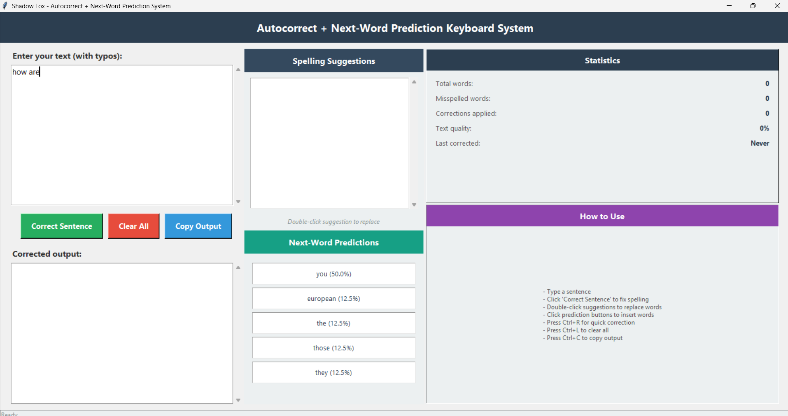
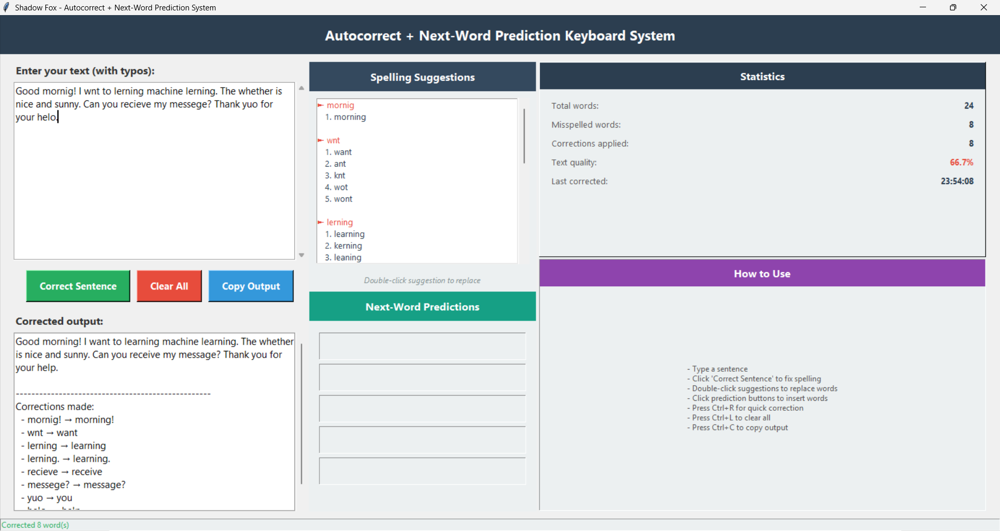

# 🔍 Autocorrect + Next-Word Prediction Keyboard System


---

## 📌 Project Overview

The **Autocorrect + Next-Word Prediction Keyboard System** is a desktop application that combines intelligent spell correction with context-based next-word prediction.

The system automatically corrects misspelled words, suggests alternative corrections, and predicts the next word using statistical **N-gram language models** trained on NLTK corpora.

This project was developed as part of the **Shadow Fox Virtual Internship Program (Intermediate Level)**.

---

## ✨ Features

### 1. Spell Checking & Autocorrection

* Detects misspelled words using PySpellChecker
* Automatically suggests the most probable correction
* Preserves capitalization patterns
* Preserves punctuation around corrected words
* Displays alternative spelling suggestions

### 2. Next-Word Prediction

* Implements Bigram, Trigram, and Quadgram language models
* Trained using Reuters and Brown corpora from NLTK
* Uses contextual information from previous words
* Displays prediction probabilities
* Provides up to 5 next-word suggestions

### 3. Interactive GUI

* Real-time text input and correction
* Spelling suggestions panel
* Next-word prediction buttons
* Statistics dashboard
* Copy and clear functionality

### 4. Additional Features

* Double-click suggestion replacement
* Keyboard shortcuts
* Text quality analysis
* Real-time prediction updates

---

## ⌨️ Keyboard Shortcuts

| Shortcut | Action           |
| -------- | ---------------- |
| Ctrl + R | Correct Sentence |
| Ctrl + L | Clear All Text   |
| Ctrl + C | Copy Output      |

---

## 🛠️ Technologies Used

| Technology          | Purpose                               |
| ------------------- | ------------------------------------- |
| Python 3.x          | Core Programming Language             |
| Tkinter             | Graphical User Interface              |
| PySpellChecker      | Spell Checking and Correction         |
| NLTK                | Corpus Processing and N-Gram Training |
| Reuters Corpus      | Language Model Training               |
| Brown Corpus        | Language Model Training               |
| Regular Expressions | Text Processing                       |

---

## 📂 Project Structure

```text
AutoCorrect-NextWord-Predictor/
│
├── autocorrect_core.py
├── ngram_predictor.py
├── ui.py
├── requirements.txt
└── screenshots/
```

---

## ⚙️ Installation

### Install Dependencies

```bash
pip install pyspellchecker nltk
```

### Run the Application

```bash
python ui.py
```

**Note:** During the first execution, NLTK resources (Reuters and Brown corpora) will be downloaded automatically if not already available.

---

## 🚀 How to Use

### Spell Correction

1. Enter text containing spelling mistakes.
2. Click **Correct Sentence** or press **Ctrl + R**.
3. View corrected output.
4. Review spelling suggestions.
5. Double-click any suggestion to replace a word.

### Next-Word Prediction

1. Begin typing a sentence.
2. Prediction buttons automatically update based on context.
3. View prediction probabilities.
4. Click a prediction button to insert the suggested word.

---

## 🧪 Test Cases

### Basic Autocorrection

| Input              | Expected Output    |
| ------------------ | ------------------ |
| helo world         | hello world        |
| how are yuo        | how are you        |
| I lvoe python      | I love python      |
| This is a tset     | This is a test     |
| recieve my messege | receive my message |

### Punctuation & Capitalization

| Input  | Expected Output |
| ------ | --------------- |
| Helo!  | Hello!          |
| (helo) | (hello)         |
| "helo" | "hello"         |
| HELO   | HELLO           |

### Paragraph Test

**Input**

```text
Helo how are yuo? I am lerning python progrmming and its realy fun.
```

**Output**

```text
Hello how are you? I am learning python programming and its really fun.
```

---

## 📊 N-Gram Prediction Methodology

The system uses statistical language models to predict the next word based on context.

| Model    | Context Used     |
| -------- | ---------------- |
| Bigram   | Previous 1 word  |
| Trigram  | Previous 2 words |
| Quadgram | Previous 3 words |

Prediction probabilities are calculated from word sequence frequencies learned from the training corpora.

---

## 📸 Screenshots

### Main Application Interface



### Testcase



### Testcase




---


